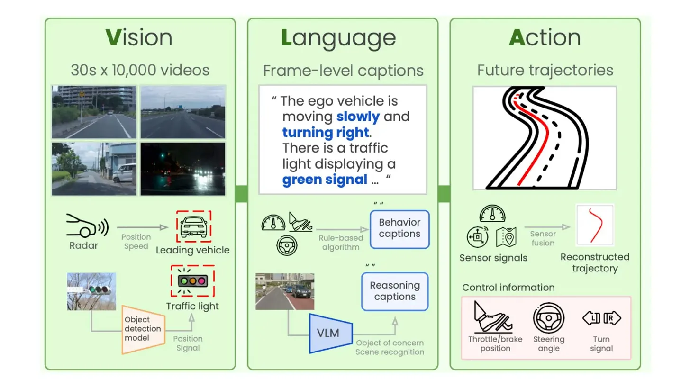

Title: Vision Language Action (VLA) Models
Date: 2026-03-26
Desc: A look at how VLA models bridge perception and physical movement, from RT-2 to pi0.
Tags: robotics, deep learning, computer vision
---

### From Pixels to Poses

Vision Language Action Models are large transformer models which predict robot actions, given observations from multiple cameras. They are usually trained on some pretrained vision language models, which makes them have a lot of knowledge of the world baked into them. VLA models bridge the gap between perception and physical movement. Unlike traditional modular pipelines, a VLA is typically end-to-end.

VLA architecture comprises of three things mainly:

- **Vision Encoder**: A pretrained vision model that encodes camera frames into visual tokens
- **Language**: A Large Language Model, this provides the reasoning and instruction following capabilities
- **Action Head**: This is the robotic part. The model does not just output text, it outputs action tokens. These tokens represent joint velocities or end effector poses (x, y, z, roll, pitch yaw, gripper).

I found these to be the general and most intuitive way to show VLA main components, a basic "see → understand → act" model. But different people have added flavours to the mix which introduce sophisticated variations to this fundamental flow. While the "see → understand → act" pipeline is the bedrock, modern architectures add layers of complexity to make the robot's motion more fluid and precise.

I would be diving into a few specific VLA models that are defining the field.

## [RT-2](https://robotics-transformer2.github.io/assets/rt2.pdf)

Developed by Google DeepMind, RT-2 is the poster child for the VLA movement. It proved that scaling works for robotics just as it does for LLMs, essentially "re-wiring" high-capacity vision-language models to output physical actions.

RT-2 isn't built from scratch. Instead, it takes massive pre-trained models — specifically [PaLI-X](https://arxiv.org/abs/2305.18565) (up to 55B parameters) and [PaLM-E](https://arxiv.org/pdf/2303.03378) (12B parameters) — and fine-tunes them for robotic tasks.

The workflow follows a specific pipeline:

- **Internet-Scale Data (Co-Fine-Tuning)**: The model is pre-trained on massive datasets of Visual Question Answering (VQA). This gives it the ability to understand that eggs and flour are used to "bake a cake," knowledge it later applies to physical objects.
- **The Robot's View**: The robot's camera feed is split into patches and fed through a ViT (Vision Transformer), combining visual information with a natural language task (e.g., *"What should the robot do to &lt;task&gt;?"*).
- **Action as Language**: The genius of RT-2 is that it treats robot actions like text tokens. Just as an LLM predicts the next word, RT-2 predicts the next "action word" (discretized into 256 "bins" for movement).

When the LLM backbone processes the instruction, it outputs a string of numbers which is processed by the De-Tokenizer. This component converts those numbers into real-world units: Translation (movement in x, y, z space) and Rotation (changing the angle of the gripper).

Then the Closed-Loop Control allows the robot to perform complex tasks like picking up an object that is "different" from others — tasks requiring a deep semantic understanding of the world.

#### Emergent Capabilities: Reasoning in the Real World

Because RT-2 is backed by a model that has "read the internet," it exhibits emergent behavior — the ability to perform tasks it was never explicitly trained for in a lab:

- **Semantic Reasoning**: If you tell RT-2 to *"pick up the extinct animal,"* it can identify a toy dinosaur because its training taught it that dinosaurs are extinct.
- **Improvised Problem Solving**: It can reason through text-based logic to choose a rock when asked to find an "improvised hammer."

#### The Trade-off: Power vs. Latency

While RT-2 achieves a 90% success rate and vastly outperforms models using only robotic data, its size is its bottleneck. At 55B parameters, it cannot run locally on most robots. It typically requires a cloud-based multi-TPU setup, resulting in inference speeds of roughly 1–5 Hz. It's a brilliant "thinker," but often too slow for high-speed, reactive tasks.

## OpenVLA

If RT-2 is the proprietary giant, [OpenVLA](https://arxiv.org/pdf/2406.09246) is the community's answer — a high-performance, open-source VLA model designed to be accessible and fine-tunable for a wide variety of robotic platforms. Unlike its predecessors that rely on massive, closed-source backbones, OpenVLA is built on a 7B-parameter Llama 2 model. This makes it powerful enough for complex reasoning but efficient enough to be practical for researchers and developers.

The architecture follows a sophisticated multi-stage pipeline:

- **Dual-Vision Encoder**: It utilizes a fused visual encoder system, combining [DinoV2](https://arxiv.org/pdf/2304.07193) and [SigLIP](https://arxiv.org/abs/2303.15343) to process the input image. This "fused" approach allows the model to capture high-level semantic meaning alongside fine-grained spatial details.
- **Reasoning Backbone**: The core of the model is the [Llama 2](https://arxiv.org/pdf/2307.09288) 7B transformer. It takes in the projected visual tokens alongside language instructions (like *"Put eggplant in bowl"*), processed through a standard Llama tokenizer.
- **Action Output**: Just like RT-2, it predicts action tokens passed through an Action De-Tokenizer, resulting in a 7D robot action vector — translation (x, y, z), rotation (roll, pitch, yaw), and gripper state.

What makes OpenVLA a major milestone is its data efficiency and scale. It was trained on the Open X-Embodiment dataset, a collection of 970,000 robot manipulation trajectories across diverse tasks and scenes. Despite having 7x fewer parameters than RT-2-X, OpenVLA outperforms it by 16.5% in absolute task success rate across nearly 30 evaluation tasks.

OpenVLA is also designed for Parameter-Efficient Fine-Tuning. Using techniques like [LoRA](https://arxiv.org/pdf/2106.09685), you can adapt this 7B model to a new robot setup or specific task using just a single consumer-grade GPU in a matter of hours — lowering the barrier to entry from "Google-level compute" to something an individual researcher or student can reasonably run.

## [SmolVLA](https://arxiv.org/pdf/2506.01844)

SmolVLA represents the move toward localized, efficient intelligence. Designed specifically to run on affordable hardware and community-driven datasets, it bridges the gap between state-of-the-art AI and the world of "affordable robots" like the [LeRobot](https://huggingface.co/lerobot) platform.

The core innovation is a split architecture that separates general reasoning from high-speed motor control:

- **The VLM Backbone**: A standard Vision-Language Model stack processes the multimodal inputs — camera frames, the text-based task, and the robot's current proprioceptive state.
- **The Action Expert**: Instead of the LLM trying to handle everything, it passes key information to a dedicated Action Expert. This specialized module uses a mix of cross-attention and self-attention to transform high-level "thoughts" into a trajectory of actions.

#### Mastering Dexterity with Diffusion

A key feature critical to SmolVLA is the integration of a Diffusion Transformer:

- **Handling Uncertainty**: In complex physical environments, there isn't always one "correct" next move. By feeding action tokens into a diffusion process with noisy actions, the model can iteratively refine its plan.
- **Smoothness and Precision**: This allows the robot to achieve more fluid, human-like motion, especially for delicate tasks requiring high-frequency adjustments.

SmolVLA proves that you don't need a massive server rack to give a robot the ability to understand instructions and interact intelligently with its environment — you just need a smarter, more compact architecture.

## [Pi0](https://www.pi.website/download/pi0.pdf)

While the models discussed so far focus on predicting discrete tokens, pi0 (developed by [Physical Intelligence](https://www.pi.website/)) marks a shift toward a more continuous, "physical" approach to robotics — designed to achieve the fluid dexterity required for complex human-like tasks, such as folding laundry or clearing a table.

pi0 is pre-trained on a diverse mix of sources, including internet pre-training, the OXE (Open X-Embodiment) dataset, and a proprietary pi dataset.

- **The Backbone**: A combination of [SigLIP](https://arxiv.org/abs/2303.15343) (400M) for vision and [Gemma](https://deepmind.google/models/gemma/) (2.6B) for language reasoning.
- **The Action Expert**: The VLM passes information to a specialized 300M parameter Action Expert, where the physical execution happens.

#### Flow Matching: From Tokens to Continuous Motion

The most critical technical departure in pi0 is how it generates actions. Instead of outputting a single "word" for a move, it uses a Flow Matching approach (similar to diffusion):

- **The Input**: The Action Expert takes in the current robot state and a set of noisy initial guesses.
- **The Process**: By iteratively refining these guesses through the transformer, it "denoises" the plan to find the most efficient and fluid path for the robot's joints.
- **The Output**: It generates a full trajectory of future actions, allowing for smoother, more reactive control.

#### Generalization Across Different "Bodies"

A defining strength of pi0 is its ability to control vastly different types of hardware using the same underlying model — 14-DoF bimanual manipulators, 18-DoF mobile manipulators, and 7- or 8-DoF single arm manipulators.

By shifting the focus from "language prediction" to "physical flow matching," pi0 represents a significant leap toward robots that don't just understand what we say but can actually move with the grace and adaptability required to function in our messy, unpredictable world.

---

We are witnessing a fundamental shift in how we build intelligent machines. VLAs are dissolving the old boundaries between perception and control, replacing rigid code with embodied intelligence.

As we move from the "Google-sized" brains of RT-2 to the efficient, dexterous "physical intelligence" of pi0 and SmolVLA, the technology is moving out of the data center and onto the workshop floor. We are moving away from robots that merely "see" and "act" toward robots that "understand" the physical consequences of their movements.

For the next generation of engineers, the challenge isn't just about writing faster algorithms — it's about curating the data and fine-tuning the models that will allow robots to navigate our messy, unpredictable world with the same common sense we take for granted. The stack is no longer just on your screen; it's finally getting a body.

*Originally published on [The Nerd Stack](https://ncep.substack.com/).*